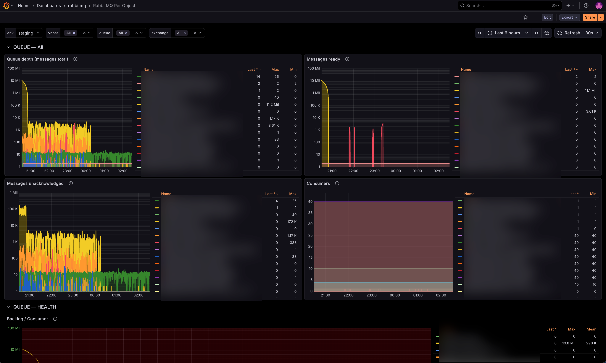
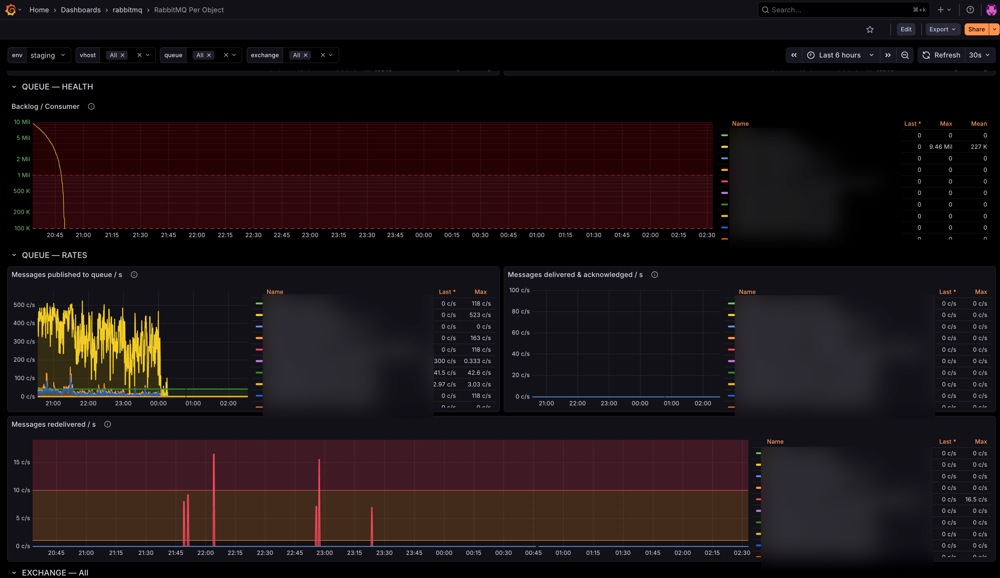
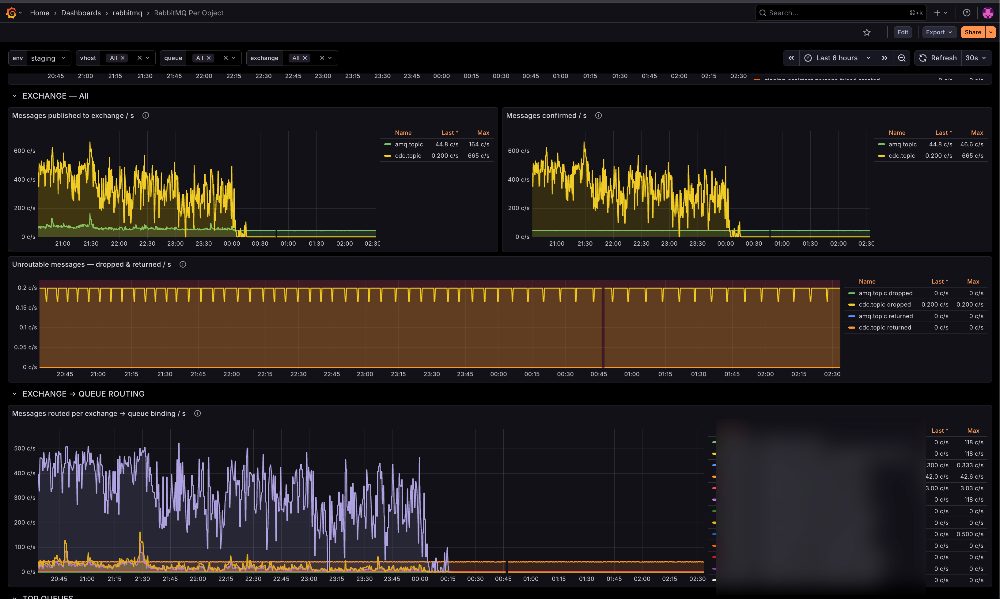

# RabbitMQ Per Object Dashboard

A Grafana dashboard for debugging RabbitMQ message flow at the **per-queue** and **per-exchange** level. It is driven by the `/metrics/per-object` endpoint of the `rabbitmq_prometheus` plugin.

It is built for on-call engineers and service owners who need to answer questions like "is this queue backed up?", "is this consumer keeping up?" or "is the message I published actually reaching its queue?". It is **not** a broker-health overview — use the stock RabbitMQ-Overview dashboard for that.

  

---

## How to use it

1. Pick the **env** (e.g. `staging`, `production`).
2. Narrow down the **vhost** (defaults to all).
3. Set **queue** and/or **exchange** to the object(s) you're investigating.
4. Walk top-to-bottom — the rows are ordered to match a typical debug flow.

### Template variables

| Variable | Source | Notes |
| --- | --- | --- |
| `DS_PROMETHEUS` | Datasource picker | Select your Prometheus datasource at import time. |
| `env` | `label_values(rabbitmq_queue_messages, env)` | Required. Comes from the Prometheus job label (see [prometheus.yml](prometheus.yml)). |
| `vhost` | `label_values(..., vhost)` | Multi-select, defaults to all. |
| `queue` | `label_values(rabbitmq_queue_messages_published_total, queue)` | Multi-select. Scoped by `env`, `vhost`, and `exchange`. |
| `exchange` | `label_values(rabbitmq_channel_messages_published_total, exchange)` | Multi-select, defaults to all. |

---

## Screenshots

**Queue state** — depth, ready, unacked, consumers. Filter bar at the top drives every panel below.



**Queue health + rates** — backlog/consumer drain-timer, publish/deliver/ack rates, and redelivery rate.



**Exchange + exchange → queue routing** — publish/confirm rates, unroutable dropped/returned, and per-binding routing rate.



---

## Panels

### QUEUE — `$queue`

| Panel | Metric | What it tells you |
| --- | --- | --- |
| Queue depth (messages total) | `rabbitmq_queue_messages` | Ready + unacked. Primary backlog signal. |
| Messages ready | `rabbitmq_queue_messages_ready` | Rising ready with no delivery rate → stuck/slow consumer. |
| Messages unacknowledged | `rabbitmq_queue_messages_unacked` | Sustained growth → prefetch too high, or consumers hung. |
| Consumers | `rabbitmq_queue_consumers` | `0` consumers on a growing queue is almost always the cause. |

### QUEUE — HEALTH

| Panel | Expression | What it tells you |
| --- | --- | --- |
| Backlog / Consumer | `messages_ready / consumers` | Rough drain-timer: how many messages each consumer would have to process to clear the ready portion. |

### QUEUE — RATES

| Panel | Metric | What it tells you |
| --- | --- | --- |
| Messages published to queue / s | `rate(rabbitmq_queue_messages_published_total)` | Inbound rate, summed across exchanges routing to the queue. |
| Messages delivered & acknowledged / s | `rate(rabbitmq_queue_messages_delivered_total)` + `rate(rabbitmq_queue_messages_acknowledged_total)` | Outbound consumer throughput. A gap between delivered and acked points at slow processing. |
| Messages redelivered / s | `rate(rabbitmq_queue_messages_redelivered_total)` | Non-zero usually means a consumer is nack'ing or crashing mid-processing. |

### EXCHANGE — `$exchange`

| Panel | Metric | What it tells you |
| --- | --- | --- |
| Messages published to exchange / s | `rate(rabbitmq_channel_messages_published_total)` | Producer-side publish rate. |
| Messages confirmed / s | `rate(rabbitmq_channel_messages_confirmed_total)` | Large gap vs published → publisher confirms are backing up. |
| Unroutable — dropped & returned / s | `rate(rabbitmq_channel_messages_unroutable_{dropped,returned}_total)` | Any sustained non-zero value means message loss or a routing/binding bug. |

### EXCHANGE → QUEUE ROUTING

| Panel | Metric | What it tells you |
| --- | --- | --- |
| Messages routed per exchange → queue binding / s | `rate(rabbitmq_queue_messages_published_total)` grouped by `(exchange, queue)` | Confirms a message published to exchange X is actually landing in queue Y. |

### TOP QUEUES

| Panel | Query | What it tells you |
| --- | --- | --- |
| Top 20 queues by depth | `topk(20, max by (queue, vhost) (rabbitmq_queue_messages))` | Fleet-wide biggest backlogs. Ignores the `queue` filter. |
| Top 20 exchanges by publish rate | `topk(20, sum by (exchange, vhost) (rate(rabbitmq_channel_messages_published_total)))` | Fleet-wide busiest exchanges. Ignores the `exchange` filter. |

---

## Prerequisites

- **RabbitMQ** with the `rabbitmq_prometheus` plugin enabled:

  ```bash
  rabbitmq-plugins enable rabbitmq_prometheus
  ```

  The per-object metrics endpoint is exposed on port **`15692`** at **`/metrics/per-object`**. See the [RabbitMQ Prometheus docs](https://www.rabbitmq.com/docs/prometheus).
- **Prometheus** scraping that endpoint under job name `rabbitmq-per-object` with an `env` label. A working example is in [prometheus.yml](prometheus.yml):

  ```yaml
  - job_name: rabbitmq-per-object
    metrics_path: /metrics/per-object
    scrape_interval: 30s
    static_configs:
      - targets: ['staging.local:15692']
        labels: { env: staging }
      - targets: ['production.local:15692']
        labels: { env: production }
  ```

  > The dashboard filters every query by `job="rabbitmq-per-object"`. If you use a different job name, search-and-replace it in [dashboard.json](dashboard.json) before importing.
- **Grafana 12.3+** with a Prometheus datasource.

---

## Installation

### Import into a self-hosted Grafana

1. Clone this repo:

   ```bash
   git clone https://github.com/SonyCore/rabbitmq-per-object-dashboard.git
   cd rabbitmq-per-object-dashboard
   ```

2. In Grafana, go to **Dashboards → New → Import**.
3. Upload [dashboard.json](dashboard.json) (or paste its contents).
4. When prompted, select your Prometheus datasource for `DS_PROMETHEUS`.

### Import by ID from Grafana.com

1. **Dashboards → New → Import**
2. Paste the dashboard ID → **Load**
3. Select your Prometheus datasource → **Import**

## License

MIT.
